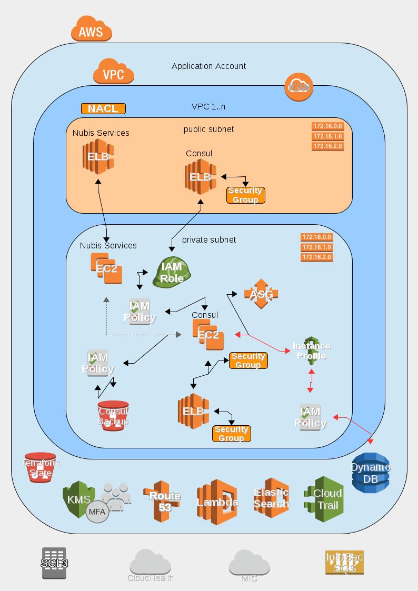

# nubis-consul

[](https://github.com/nubisproject/nubis-consul/releases)
[](https://travis-ci.org/nubisproject/nubis-consul)
[](https://github.com/nubisproject/nubis-consul/issues)

## Consul Deployment

The Consul project is designed to be deployed into a standard Nubis Account. It
takes advantage of the standard deployment found [here](https://github.com/nubisproject/nubis-docs/blob/master/DEPLOYMENT_OVERVIEW.md).
For further specifics about Consul consult the documentation [here](https://www.consul.io/).

### Deployment Diagram



**NOTE**: The line colors are representative and are for readability only. They
are not intended to indicate any underlying protocol or specific communication
details.

### Deployment Notes

The Nubis Consul deployment consists of:

- Instances deployed on EC2 in an Auto Scaling group
- An external Elastic Load Balancer (ELB) which has a Security Group which
  restricts access to a list of IP addresses. The primary function is to allow
  access to the Continuous Integration (CI) system in the Admin VPC.
- An internal Elastic Load Balancer (ELB) with a Security Group which restricts
  access to Nubis Deployed Instances. The function of this ELB is to provide
  access to instances running within the VPC and ensures a stable endpoint in
  the event of AutoScaling.
- A Dynamo DB table which contains startup configuration information. This
  information is encrypted at rest. The EC2 instances are created with an IAM
  instance profile which allows access to a KMS key which is used to decrypt
  the configuration information.
- A S3 bucket which contains backup data. This bucket is accessible only to
  Consul EC2 instances via an IAM Policy which is attached at boot via the
  AutoScaling Launch Configuration.

### Deployment Resources

Details for the deployment including; naming conventions, relationships,
permissions, etcetera, can be found in the [Terraform template](nubis/terraform/main.tf)
used for deployment. Links to specific resources can be found in the following
table.

|Resource Type|Resource Title|Code Location|
|-------------|--------------|-------------|
|aws_launch_configuration|consul|[nubis/terraform/main.tf#L8](nubis/terraform/main.tf#L8)|
|aws_autoscaling_group|consul|[nubis/terraform/main.tf#L36](nubis/terraform/main.tf#L36)|
|aws_security_group|consul|[nubis/terraform/main.tf#L73](nubis/terraform/main.tf#L73)|
|aws_elb|consul|[nubis/terraform/main.tf#L130](nubis/terraform/main.tf#L130)|
|aws_elb|consul-public|[nubis/terraform/main.tf#L169](nubis/terraform/main.tf#L169)|
|aws_security_group|elb|[nubis/terraform/main.tf#L199](nubis/terraform/main.tf#L199)|
|aws_security_group|elb-public|[nubis/terraform/main.tf#L228](nubis/terraform/main.tf#L228)|
|aws_route53_record|ui|[nubis/terraform/main.tf#L250](nubis/terraform/main.tf#L250)|
|aws_route53_record|public|[nubis/terraform/main.tf#L258](nubis/terraform/main.tf#L258)|
|aws_s3_bucket|consul_backups|[nubis/terraform/main.tf#L266](nubis/terraform/main.tf#L266)|
|aws_iam_instance_profile|consul|[nubis/terraform/main.tf#L280](nubis/terraform/main.tf#L280)|
|aws_iam_role|consul|[nubis/terraform/main.tf#L285](nubis/terraform/main.tf#L285)|
|aws_iam_role_policy|consul|[nubis/terraform/main.tf#L306](nubis/terraform/main.tf#L306)|
|aws_iam_role_policy|consul_backups|[nubis/terraform/main.tf#L343](nubis/terraform/main.tf#L343)|
|aws_iam_role_policy|credstash|[nubis/terraform/main.tf#L372](nubis/terraform/main.tf#L372)|
|tls_private_key|consul_web|[nubis/terraform/main.tf#L461](nubis/terraform/main.tf#L461)|
|tls_self_signed_cert|consul_web_public|[nubis/terraform/main.tf#L465](nubis/terraform/main.tf#L465)|
|tls_self_signed_cert|consul_web_ui|[nubis/terraform/main.tf#L489](nubis/terraform/main.tf#L489)|
|aws_iam_server_certificate|consul_web_public|[nubis/terraform/main.tf#L519](nubis/terraform/main.tf#L519)|
|aws_iam_server_certificate|consul_web_ui|[nubis/terraform/main.tf#L530](nubis/terraform/main.tf#L530)|
|null_resource|credstash-public|[nubis/terraform/main.tf#L546](nubis/terraform/main.tf#L546)|
|null_resource|credstash|[nubis/terraform/main.tf#L563](nubis/terraform/main.tf#L563)|

### Dependencies

You need [credstash](https://github.com/fugue/credstash) locally installed
(in your PATH) to be able to deploy Consul

Mozilla Nubis Consul

You need to run

```bash

$> nubis/bin/makecert

```

Before deploying, to generate the SSL key and cert

### Building project

This assumes you are in the project directory

- Build AMI and make note of AMI ID

    ```bash

    nubis-builder build

    ```

- Generate certificate

    ```bash

    cd nubis/terraform
    ../bin/makecert

    ```

- Configure tfvars file

    ```bash

    cd nubis/terraform
    cp terraform.tfvars-dist terraform.tfvars
    <edit tfvar files with appropriate info>

    ```

- Check if terraform plan gives you the right info (for sanity sake)

    ```bash

    cd nubis/terraform
    terraform plan

    ```

- Verify if output looks sane and then deploy

    ```bash

    terraform apply

    ```

- ???
- Profit

### NOTE
